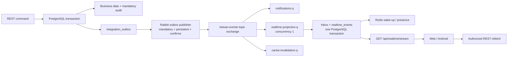

# Business realtime: transactional Pub/Sub + SSE

## Runtime topology

Delivery is **at least once**, never exactly once. A publisher confirm can succeed before the
`published_at` update fails; the message is then published again and the consumer's
`(consumer_name,message_id)` Inbox key removes the duplicate.

RabbitMQ and SSE events carry invalidation metadata, not sensitive business rows. PostgreSQL remains
the source of truth. Redis is only an accelerator: a Redis outage causes cache misses, unknown
presence and SSE polling, but does not lose durable realtime events or fail business commands.

Cache-aside uses per-scope generation keys (`cache:generation:{scope}`), so an idempotent consumer
invalidates a logical scope without `KEYS`/`SCAN`; old generations expire naturally. Soft locks use
owner-token `SET NX PX`, owner-only Lua renew and owner-only Lua release. They never replace the
PostgreSQL `version` check.

## Feature flags and cutover

| Setting | Purpose | Production target |
|---|---|---|
| `Realtime:SseEnabled` | authenticated replayable business stream | `true` |
| `Messaging:RabbitMq:Enabled` | Rabbit publisher and consumers | `true` |
| `Redis:Enabled` | wake-up, presence and soft-lock accelerator | `true` |
| `Messaging:ProcessedRetentionDays` | how long processed outbox/inbox rows are kept | `7` |

When RabbitMQ is disabled, `LocalRealtimeProjector` provides a clearly logged development mode. It
still uses the durable outbox/inbox/event-store transaction but is not the production Pub/Sub path.

## RabbitMQ deployment

Copy `deploy/messaging/.env.example` to `.env`, replace both local passwords, then run
`docker compose up -d`. The committed files contain no production credential. The definitions apply
5-second, 30-second and 2-minute retry TTL policies plus at-least-once dead-lettering policies for
quorum queues. Application code deliberately does not hard-code mutable TTL/DLX policy arguments.

The local compose is one Rabbit node and is **not HA**. Even three containers on the same machine do
not create production HA because they share a failure domain. Production should use managed RabbitMQ
with quorum queues or three Rabbit nodes on independent VMs/machines, and TLS credentials supplied by
the deployment secret store.

Queue ownership is capability-based: `notifications.q`, `realtime-projection.q`, and
`cache-invalidation.q` each receive their own event copy. Realtime projection currently uses one
consumer dispatch lane to preserve stable sequence assignment. Partition by tenant/audience only when
volume requires it.

With Rabbit enabled, `OutboxQueue` writes deterministic, deduplicated
`notifications.push.requested.v1` integration events and `notifications.q` invokes the existing FCM
dispatcher behind Inbox/manual acknowledgement. With Rabbit disabled it keeps writing `app_outbox`,
preserving rollback compatibility and the existing background-notification behavior.

## PostgreSQL migration and rollback

`deploy/database/migrations/002_pubsub_sse.sql` is forward-only, transactional and idempotent. Startup
also runs the equivalent guarded migration before installing legacy table triggers. It does not drop,
truncate or recreate legacy tables.

Rollback is a traffic/config rollback, not a destructive schema rollback:

1. Set `Realtime:SseEnabled=false` and roll business clients back to their polling safety net.
2. Set `Messaging:RabbitMq:Enabled=false`; pending outbox rows remain recoverable.
3. Do **not** drop `integration_outbox`, `inbox_messages`, `realtime_events`, `api_idempotency` or
   `messaging_dead_letters` until retention/forensics are complete.
4. If the trigger bridge itself must be disabled, drop only the triggers named
   `ketoanmini_publish_change_ins` / `_upd` / `_del` (installations before the transition-table fix
   have a single combined `ketoanmini_publish_change` trigger instead); preserve the function and
   tables until after audit.

The legacy trigger bridge writes one `realtime.invalidate.v1` outbox row per PostgreSQL
transaction/scope. No trigger is installed on outbox, inbox, idempotency or realtime tables,
preventing recursion. Modules should progressively replace bridge events with immutable versioned
integration contracts.

Each watched table carries three statement-level triggers rather than one combined trigger, because
PostgreSQL only allows a transition table (`REFERENCING NEW/OLD TABLE`) on a single-event trigger.
The shared trigger function returns immediately when that transition table is empty. Without that
gate a statement matching **zero** rows still published: the authentication layer runs exactly one
such `UPDATE user_sessions ... AND last_seen < now() - 2 minutes` on every request, so ten read-only
`GET`s produced ten global `presence` invalidations, one durable outbox row and one realtime row
each. The middleware now also reads a `last_seen_stale` flag from the session `SELECT` it already
issues and skips sending that `UPDATE` entirely until it is due.

### Presence

`user_sessions` is the most-written table in the system, and presence used to be its own denial of
service: every keep-alive touch published a global `presence` invalidation, so cost grew with the
*square* of the number of signed-in clients in order to announce "this person is still online, same as
a minute ago". Presence is now defined by three rules, and `PresencePolicy` owns the two constants so
they cannot drift apart:

- **Online window** (90 s) — the silence after which a session stops counting as online. Used by the
  `is_online` flags in `/api/users` and `/api/directory`.
- **Touch throttle** (60 s) — how often an active session rewrites `last_seen`. It **must** stay below
  the online window. It used to be 2 minutes against a 90-second window, so a person actively working
  in the browser was displayed offline for 30 seconds out of every 2 minutes, and each "revival" was a
  genuine transition worth broadcasting. Keeping the throttle under the window means an active session
  is continuously online *and* silent.
- **The SSE connection is the heartbeat.** The stream's 30-second session revalidation is now a single
  `UPDATE … RETURNING` that both checks the session and refreshes `last_seen`. The stream only exists
  while the app is actually open (Android closes it on pause), which is exactly what presence means.
  Before this, with Redis disabled, an Android client with a healthy stream only pinged every 5
  minutes against a 90-second window, so people using the app showed as offline most of the time.

`user_sessions` therefore uses a **row-level** `UPDATE` trigger with a `WHEN` clause (`UpdateGuards`)
instead of the statement-level one: only row level can compare `OLD` with `NEW`. It publishes on
logout/revocation/ownership change and on a `last_seen` jump larger than the online window — that jump
is precisely the offline→online transition. The `bridge_key` dedupe still collapses a bulk revocation
to one event per transaction.

The opposite transition, online→offline, happens through the *passage of time* and writes nothing, so
no trigger anywhere can announce it. The two screens that render the badge refresh themselves slowly
instead (`presencePollMs` in `useApi.ts`, `startDirectoryPresenceRefresh` in `HrViewModel.kt`), and
only while visible.

`PostgresWakeListener` holds one dedicated `LISTEN` connection. The bridge trigger and
`BusinessEventWriter` both `pg_notify` the change channel inside the business transaction, which
wakes the outbox projector/publisher the moment that transaction commits; the projector notifies a
second channel with the new `sequence_no` after `realtime_events` is written, which wakes SSE loops
in every process. The old one-second/two-second polls remain as the safety net. Measured end to end
over Kestrel, a write became visible to another client in ~1.6 s before and ~10–70 ms after.

`RealtimeRetentionWorker` sweeps hourly. Besides expired `realtime_events` it deletes
`integration_outbox` rows already published and `inbox_messages` rows already completed for longer
than `Messaging:ProcessedRetentionDays` (default 7), in `SKIP LOCKED` batches. Neither table had any
retention before, so both grew without bound — the test database had reached 819k outbox rows and
2.1 GB. Unpublished rows and `messaging_dead_letters` are never touched.

Envelope timestamps are normalised with `ToUniversalTime()` before they are written back, because
Npgsql only accepts a zero-offset `DateTimeOffset` for `timestamptz`. The bridge trigger renders
`occurredAt` using the *writing connection's* `TimeZone`, so any write from a connection that is not
set to UTC — psql, pgAdmin, a maintenance script, another service — produced an event that could never
be projected.

`LocalRealtimeProjector` handles each claimed message inside its own `try`. A message that cannot be
projected is rescheduled with the outbox's exponential backoff and, after 8 attempts, moved to
`messaging_dead_letters` and marked processed. Previously the exception escaped to the batch loop:
because a batch is always claimed oldest-first, one unparsable row froze **all** realtime delivery
indefinitely behind it. This was not hypothetical — eight such rows had been blocking 392 real events
in the test database for nearly three days, visible only as a repeated warning line.

`MessagingDbContext` is the EF Core/Npgsql baseline for only the new infrastructure tables. It is
registered as a context factory but never calls `EnsureCreated`; the guarded SQL migration stays
authoritative so EF cannot recreate the legacy schema. Future module contexts should own separate
schemas and migration histories.

`cash_fund_manual_entries` is the first incrementally migrated business aggregate: it exposes
`version`, returns ETag/version, accepts `If-Match`, and returns 412 for stale writes. Create/reverse
support `Idempotency-Key`; when present, mutation, mandatory audit, integration outbox and stored
response commit together. Missing keys are temporarily accepted for old clients. Apply the same
wrapper/version pattern module-by-module before claiming every legacy command is protected.

## SSE contract

`GET /api/realtime/stream` requires the normal cookie or Bearer session. It returns
`text/event-stream`, `X-Accel-Buffering: no`, event `id` equal to `realtime_events.sequence_no`, a
17-second heartbeat comment, and a 3-second retry hint. Web resumes with `?after=` because native
`EventSource` cannot set `Last-Event-ID`; Android sends both header and query fallback. A cursor of
`0` counts as "no cursor" on both sides: a freshly installed client must get the bootstrap, not a
replay of the whole retention window.

The web client cannot rely on `EventSource` alone to recover. The browser retries a dropped
connection, but an HTTP status response (401 while a session rolls over, a 502 from the tunnel while
the backend restarts) closes the stream permanently. Because the web has no polling fallback, that
left the page silently frozen on stale data until a manual reload; `realtime.ts` now reconnects with
jittered exponential backoff on `readyState === CLOSED`, and immediately on `online` or when the tab
becomes visible again.

### Topics and per-connection filtering

Every event carries one topic in `realtime_events.scope`, and the first element of every web query
key is that topic name. The accounting side used to share a single catch-all topic named `data`, so
editing one receipt woke every open screen on every machine: sales, purchases, receivables, the cash
book and the product catalogue. It is now split into `sales`, `debts`, `cash`, `purchases` and
`catalog`; the table-to-topic map lives in `Realtime/DatabaseChangePublisher.Watched` and must stay
in step with `SCOPES` in `frontend/src/lib/realtime.ts`.

Splitting alone saves nothing, because every frame still reached every connection. The stream now
accepts `?topics=a,b,c` and drops frames outside that list. The web client derives the list from the
queries that currently have observers, so it reflects the screens actually open rather than a
hand-maintained route table. A connection that sends no list receives everything, which is what
Android and any older client do.

Two rules keep the filter from causing silent staleness. Session-level events (`access`, and the
`all` bootstrap) bypass it, because they are not "some screen is stale" but "your session changed".
And the server cursor advances past dropped frames while the client's `Last-Event-ID` does not, so
when the topic list widens the reconnect carries the older cursor and the previously dropped frames
are replayed. Filtering inside the SQL query would break exactly this: the cursor would stall behind
every skipped row and rescan it on each loop until the row expired.

No cursor means `resync.required` bootstrap followed by race-free events after the captured high-water
mark. A cursor outside the 48-hour default retention also receives `resync.required`. Reads are bounded
to 128 rows and writes are awaited, so a slow client cannot create an unbounded per-connection queue.
Session validity is rechecked every 30 seconds. Redis wake-up is backed by a two-second PostgreSQL poll.

Cloudflare Tunnel and the Rust compatibility gateway must pass chunks without compression/buffering,
forward `Authorization`, cookies and `Last-Event-ID`, and cancel upstream when downstream disconnects.
The Rust proxy forwards `Body` directly and has a first-chunk timing test. Keep proxy idle timeout above
20 seconds; the heartbeat is intentionally below that threshold.

Run `deploy/messaging/smoke-sse.ps1` against both the direct .NET URL and public/gateway URL after each
deployment.

## DLQ runbook

1. Inspect Rabbit management and `GET /api/admin/messaging/dlq` (requires `users.manage`).
2. Classify configuration/schema/contract errors as permanent; repair the producer or consumer first.
3. Use `POST /api/admin/messaging/dlq/{id}/replay` only after repair. Replay creates a new Event ID,
   links `causationId` to the failed event, marks the DLQ row and writes audit in the same transaction.
4. Confirm the new outbox row is published, each Inbox completes, and realtime sequence advances.
5. Never purge a DLQ to make monitoring green. Export/retain evidence according to audit policy.

## Communication boundary

The chat, P2P transfer, voice/video calling and WebSocket signaling sources were extracted to
`communication-standalone/`. The current business host has no SignalR hub or communication route.

## Modular-monolith and gRPC ADR

The new code is grouped under `BuildingBlocks.Persistence`, `Messaging`, `Outbox`, `Idempotency` and
`Realtime` namespaces inside the current host to avoid a risky physical-project big bang. These are
the seams for future `KetoanMini.Host`, per-module DbContexts/schemas, and module projects. Modules must
exchange IDs and versioned integration contracts, never cross-reference another module's entities.

gRPC is an extension point only after a backend module is extracted into a separate service. The
current modular monolith uses in-process calls plus integration events; adding gRPC now would add a
network failure boundary without a deployment boundary.

## Operational references

- RabbitMQ confirms/mandatory publishing: https://www.rabbitmq.com/tutorials/tutorial-seven-dotnet
- Quorum queues and safe dead-lettering: https://www.rabbitmq.com/docs/quorum-queues
- Policy-based DLX: https://www.rabbitmq.com/docs/dlx
- ASP.NET Core response flushing: https://learn.microsoft.com/aspnet/core/fundamentals/middleware/request-response
- Npgsql EF Core 8: https://www.npgsql.org/efcore/release-notes/8.0.html
- StackExchange.Redis atomic-operation guidance: https://stackexchange.github.io/StackExchange.Redis/Transactions.html
